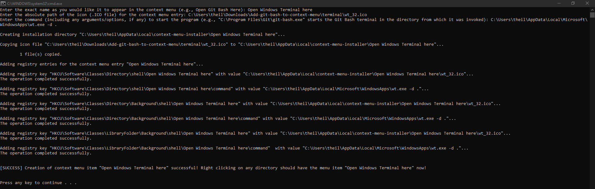
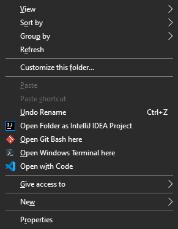

# Add Context Menu Entry For Programs

This is a simple utility to add and remove entries from the Windows context menu.

## How to use it?

### Add entries to the context menu

To add a program as an entry with a custom *menu item name*, you need to have the program installed beforehand. You can also specify an icon for the menu item (an .ico file) - for which you will need to find and store the .ico file somewhere on your disk. Specifying an icon via an .ico file is completely optional, just press enter when prompted to enter the path to the .ico file. Then simply run the `add-entry.bat` script.

Here's an example run:

### Removing entries from the context menu

Simply run the `remove-entry.bat` script and specify the *exact* name of the entry you want to delete. For example, if one day I decided that my friendship with Windows Terminal has ended and Git Bash is my new best friend (if you get this reference, beer's on me), I will specify `Open Windows Terminal here` as the entry name to remove (assuming when I ran `add-entry.bat`, this is the entry name I specified).

**Accidentally specifying the incorrect entries may screw up your Registry! PLEASE BE CAREFUL!**

## What is a context menu on Windows?

It is the menu that appears when you right click on a directory. It looks like the following:

## What does this utility "exactly" do?

This utility helps add (and remove) entries from the context menu. The entries can target "programs" that can be opened in the context of a working directory. Main targets of this utility being terminal emulators (e.g., Git Bash, Windows Emulator), text editors (e.g., Notepad++) and IDEs (e.g., Visual Studio Code).

Known limitations:
* You cannot specify special characters in the entry name

## But aren't there shortcuts of doing this already?

There are, for example, you could just navigate to the required directory in File Explorer, type `powershell` in path bar the top, and a Powershell instance will start in the current directory. But there are a few shortcomings - you may not always know the name of the "binary" executable of the program by heart (if you are like me), and, if your work involves navigating the files via file explorer a lot, it's just easy to right click and then left click, and go on with your life.

Simply put, I "adapted" this (see the Credits section) utility from an existing solution since I am too lazy. :P

## Credits

I was Googling around for a way to add programs to the context menu when I came across [this work](https://github.com/BroJenuel/Explorer-Context-Menu-Integration-for-windows-terminal) done by [Jenuel Oras Ganawed](https://github.com/BroJenuel). I just adapted his Batch files to be more usable in a generic way.
